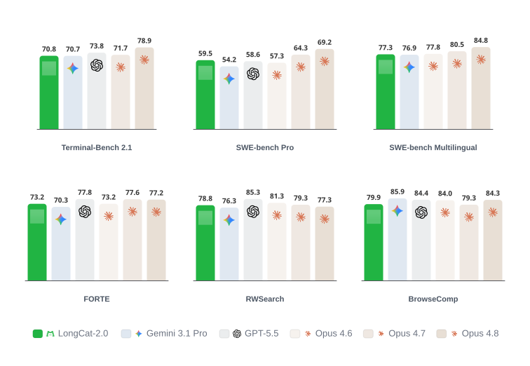

# LongCat-2.0

  

  <!--  -->
  

  
  <!--  -->
  

  

  <a href="https://longcat.chat/blog/longcat-2.0"><b>Tech Blog</b>&nbsp;📄</a>

## Model Introduction
We introduce LongCat-2.0, a large-scale MoE language model with **1.6 trillion total parameters** and ~48 billion activated per token — a substantial step up from previous LongCat models, accompanied by several architectural improvements.

Both the full training run and the large-scale deployment are built entirely on **AI ASIC superpods**. Pretraining spans millions of accelerator-hours across more than 35 trillion tokens, with no rollbacks or irrecoverable loss spikes — demonstrating that we have the capability to conduct frontier-scale training on alternative hardware platforms.

To strengthen the model on long-horizon tasks, we introduce LongCat Sparse Attention and train LongCat-2.0 on hundreds of billions of tokens of **1M-context** data. Together with dedicated post-training, this gives LongCat-2.0 strong performance on coding and agentic tasks.

  

### Key Features

#### 🌟 LongCat Sparse Attention
To address the output discontinuity and quadratic scoring bottleneck of the Lightning Indexer in [DSA](https://huggingface.co/deepseek-ai/DeepSeek-V3.2-Exp), we introduce LongCat Sparse Attention (LSA). LSA features three orthogonal, plug-and-play improvements:

- Streaming-aware Indexing (SI) reshapes the token selection budget to combine hardware-aligned contiguous access with dynamic random selection. This turns fragmented memory access into predictable sequential reads, achieving coalesced HBM access and high effective bandwidth.
- Cross-Layer Indexing (CLI) leverages the empirical stability of attention saliency across adjacent layers to amortize indexing cost: a single indexing pass serves several consecutive layers at inference time, made possible by cross-layer distillation during training.
- Hierarchical Indexing (HI) uses a coarse-to-fine, two-stage scoring scheme — first a coarse recall via block-level approximate scoring, then fine-grained token selection within the recalled candidates — shrinking the candidate space the indexer must process per query.

All strategies seamlessly extend to the 3-step Multi-Token Prediction module for speculative decoding. For CLI, the target model shares an index every 2 layers, while all 3 MTP draft steps share a single pass.

#### 🌟 N-gram Embedding
LongCat-2.0 inherits N-gram Embedding from [LongCat-Flash-Lite](https://huggingface.co/meituan-longcat/LongCat-Flash-Lite), improving parameter utilization efficiency by expanding parameters in sparse dimensions orthogonal to MoE. 135B N-gram Embedding parameters are included in the model, which adheres to the following scaling principles:

- The sparsity of MoE has crossed the sweet spot. 
- The proportion of N-gram Embedding is constrained within an optimal range. 

These two principles guarantee the robust superiority of N-gram Embedding compared to equivalent-sized pure MoE models.

**For more details please refer to our [blog](https://longcat.chat/blog/longcat-2.0/).**

## Evaluation Results
We evaluate LongCat-2.0 against leading proprietary and open-weight models across agentic, coding, search, productivity and foundational capabilities. Unless noted with `*`, all scores are measured in-house under a unified harness; per-benchmark best results are shown in bold.

<table>
<thead>
<tr>
<th>Benchmark</th>
<th align="center">LongCat-2.0</th>
<th align="center">Gemini 3.1 Pro</th>
<th align="center">GPT-5.5</th>
<th align="center">Claude Opus 4.6</th>
<th align="center">Claude Opus 4.7</th>
<th align="center">Claude Opus 4.8</th>
</tr>
</thead>
<tbody>
<tr><td colspan="7" align="center"><strong>Code Agent</strong></td></tr>
<tr>
<td>Terminal-Bench 2.1</td>
<td align="center"><strong>70.8</strong></td>
<td align="center">70.7*</td>
<td align="center">73.8*</td>
<td align="center">-</td>
<td align="center">71.7*</td>
<td align="center">78.9*</td>
</tr>
<tr>
<td>SWE-bench Pro</td>
<td align="center"><strong>59.5</strong></td>
<td align="center">54.2*</td>
<td align="center">58.6*</td>
<td align="center">57.3*</td>
<td align="center">64.3*</td>
<td align="center">69.2*</td>
</tr>
<tr>
<td>SWE-bench Multilingual</td>
<td align="center"><strong>77.3</strong></td>
<td align="center">76.9*</td>
<td align="center">-</td>
<td align="center">77.8*</td>
<td align="center">80.5*</td>
<td align="center">84.8*</td>
</tr>
<tr><td colspan="7" align="center"><strong>General Agent</strong></td></tr>
<tr>
<td>FORTE <a href="https://github.com/AGI-Eval-Official/FORTE">↗</a></td>
<td align="center">73.2</td>
<td align="center">70.3</td>
<td align="center"><strong>77.8</strong></td>
<td align="center">73.2</td>
<td align="center">77.6</td>
<td align="center">77.2</td>
</tr>
<tr>
<td>BrowseComp</td>
<td align="center">79.9</td>
<td align="center"><strong>85.9*</strong></td>
<td align="center">84.4*</td>
<td align="center">84.0*</td>
<td align="center">79.3*</td>
<td align="center">84.3*</td>
</tr>
<tr>
<td>RWSearch <a href="https://github.com/AGI-Eval-Official/RW-Search">↗</a></td>
<td align="center">78.8</td>
<td align="center">76.3</td>
<td align="center"><strong>85.3</strong></td>
<td align="center">81.3</td>
<td align="center">79.3</td>
<td align="center">77.3</td>
</tr>
<tr><td colspan="7" align="center"><strong>Foundational</strong></td></tr>
<tr>
<td>IFEval</td>
<td align="center">90.0</td>
<td align="center"><strong>96.1</strong></td>
<td align="center">95.0</td>
<td align="center">92.2</td>
<td align="center">88.7</td>
<td align="center">86.0</td>
</tr>
<tr>
<td>Writing Bench</td>
<td align="center">83.8</td>
<td align="center">83.7</td>
<td align="center"><strong>84.7</strong></td>
<td align="center">-</td>
<td align="center">85.3</td>
<td align="center">85.2</td>
</tr>
<tr>
<td>IMO-AnswerBench</td>
<td align="center">81.8</td>
<td align="center"><strong>90.0</strong></td>
<td align="center">79.5</td>
<td align="center">75.3*</td>
<td align="center">81.8</td>
<td align="center">75.3</td>
</tr>
<tr>
<td>GPQA-diamond</td>
<td align="center">88.9</td>
<td align="center"><strong>94.3*</strong></td>
<td align="center">93.6*</td>
<td align="center">91.3*</td>
<td align="center">94.2*</td>
<td align="center">92.4</td>
</tr>
</tbody>
</table>

Notes: `*` — cited from the model's official report; `-` — no comparable public score.

## Quick Start

## Deployment

## Chat Website
You can chat with LongCat-2.0 on our official website: [https://longcat.chat/](https://longcat.chat/).

## License Agreement

The **model weights** are released under the **MIT License**. 

Any contributions to this repository are licensed under the MIT License, unless otherwise stated. This license does not grant any rights to use Meituan trademarks or patents. 

See the [LICENSE](LICENSE) file for the full license text.

## Usage Considerations 
This model has not been specifically designed or comprehensively evaluated for every possible downstream application. 

Developers should take into account the known limitations of large language models, including performance variations across different languages, and carefully assess accuracy, safety, and fairness before deploying the model in sensitive or high-risk scenarios. 
It is the responsibility of developers and downstream users to understand and comply with all applicable laws and regulations relevant to their use case, including but not limited to data protection, privacy, and content safety requirements. 

Nothing in this Model Card should be interpreted as altering or restricting the terms of the MIT License under which the model is released.

## Citation

## Contact
Please contact us at <a href="mailto:longcat-team@meituan.com">longcat-team@meituan.com</a> or join our WeChat Group if you have any questions.

#### WeChat Group

---
